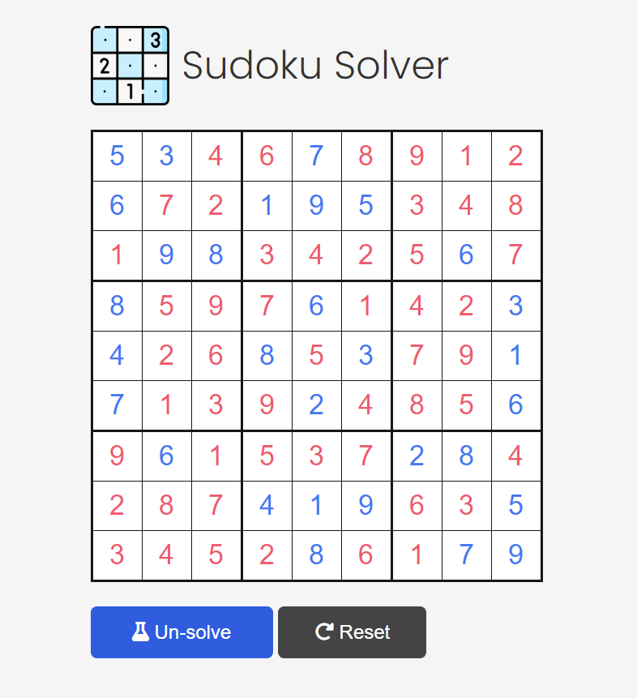
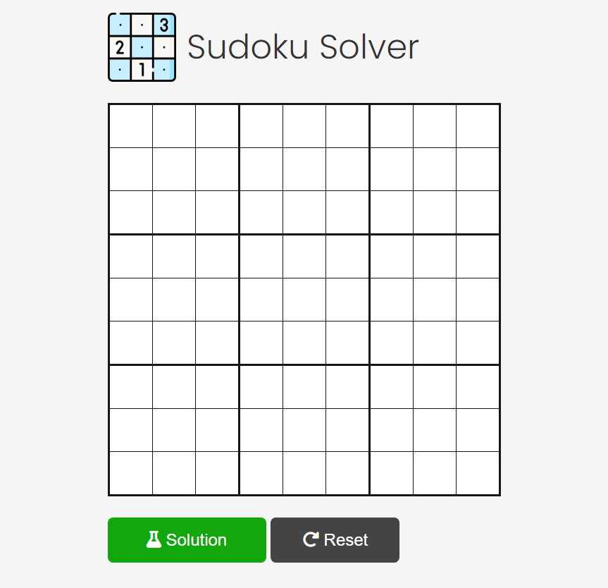

# Sudoku Solver Web Application

This is a simple web-based Sudoku solver that allows users to input a Sudoku puzzle and solve it in real-time. The project is built with **HTML**, **CSS**, and **JavaScript** using a **backtracking algorithm** for solving the puzzle. The goal of this project is to provide a clean, intuitive interface where users can interactively input a Sudoku puzzle, solve it, or reset the grid.

## User Interface Screenshot

## Features

- **Interactive Sudoku Grid**: Users can input their Sudoku puzzle directly into the grid.
- **Responsive Design**: The application is designed to be responsive and adapts well to different screen sizes, including mobile devices.
- **Solve Button**: Clicking the "Solve" button runs the backtracking algorithm to attempt solving the Sudoku.
- **Reset Button**: Users can reset the grid to its default state and input a new puzzle.

## User Alerts

- **Invalid Sudoku Input**: The user will receive an alert if the input violates Sudoku rules.
- **Unsolvable Sudoku**: An alert will notify the user if the Sudoku puzzle is unsolvable.

### Sudoku Rules

1. Each number from 1 to 9 must appear exactly once in each row.
2. Each number from 1 to 9 must appear exactly once in each column.
3. Each number from 1 to 9 must appear exactly once in each 3x3 sub-grid.

## Algorithm

The current implementation uses a **backtracking algorithm** to solve the puzzle. Backtracking works by attempting to fill each empty cell with a number that complies with Sudoku's rules, and recursively proceeds. If it reaches an invalid state, it backtracks and tries another number.

### Future Improvements

The algorithm is currently being optimized by implementing **Minimum Remaining Values (MRV)** and **forward checking**. These improvements will help by:

- **MRV**: Reducing the search space by attempting cells with fewer possible options first.
- **Forward Checking**: Preventing conflicts by checking the validity of future moves earlier in the process, thus avoiding unnecessary searches.

## Technologies Used

- **HTML** for the structure of the webpage.
- **CSS** for styling the application, ensuring responsiveness and a clean layout.
- **JavaScript** for the logic and implementation of the Sudoku solving algorithm.

## How to Run the Project

Simply open the `index.html` file in any modern web browser, input a Sudoku puzzle into the grid, and click "Solve" to see the solution or "Reset" to start over.
